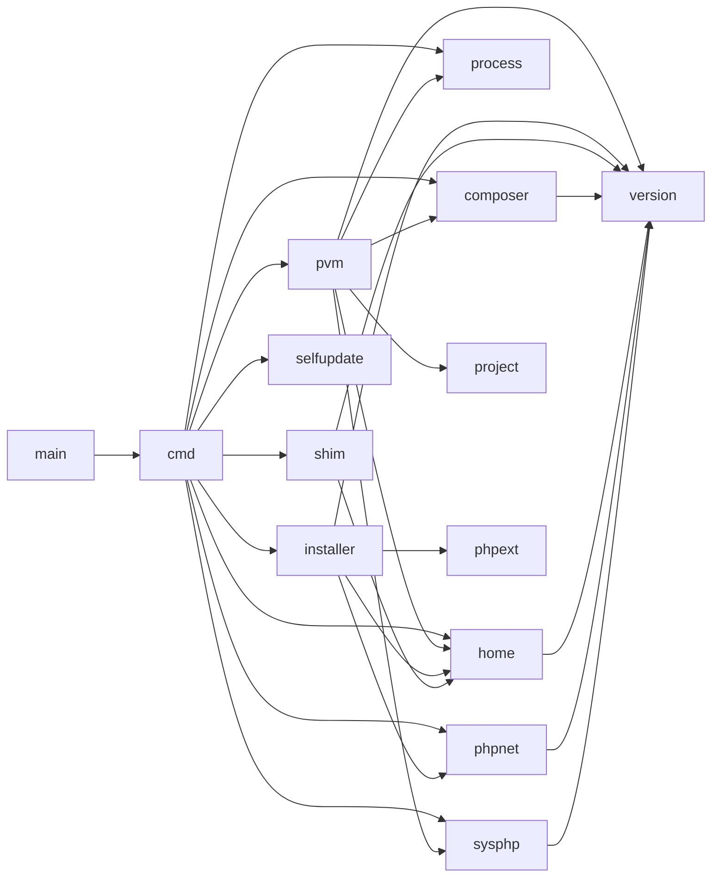

# Architecture

For the end-to-end flow across commands — lifecycle, state files and platform differences — see [flow.md](flow.md). This document covers packages and code-level data flow.

## Principles

The layout follows common Go conventions rather than named layers:

- **`main.go` at the root, Cobra commands in `cmd/`** (the cobra-cli layout), so `go install github.com/rejmann/pvm@latest` keeps working.
- **Packages in `internal/` are named for what they provide** (`home`, `installer`, `shim`, `phpnet`…), not for a layer.
- **Commands are thin.** A command parses its arguments, calls a use case in `internal/pvm` and prints the result. It holds no rules.
- **Interfaces live with the consumer.** `internal/pvm` declares the small interfaces it needs (`Installer`, `Activator`, `ExtensionInstaller`, `ComposerSource`), and the packages that talk to the system return concrete types that happen to satisfy them ("accept interfaces, return structs").
- **One place per concern.** Only `internal/home` builds paths inside the pvm home. Only `internal/process` runs the programs pvm hands over to (php, Composer). Only the `_linux.go` / `_darwin.go` / `_windows.go` files know which OS they run on: there is no `switch runtime.GOOS`.

## Package layout

```
pvm/
├── main.go                     # builds the root command with the build version and runs it
├── cmd/                        # Cobra commands: arguments in, messages out
│   ├── root.go                 # NewRootCmd(version): the command tree, no globals
│   ├── manager.go              # newManager(): wires internal/pvm to this system
│   ├── available.go  install.go  list.go  use.go  remove.go
│   ├── current.go  which.go  run.go  shim.go  composer.go
│   ├── self_upgrade.go  self_remove.go  lts_resolver.go
│   └── os_unix.go / os_windows.go   # PATH setup and permission hints per OS
└── internal/
    ├── pvm/                    # use cases, independent of the command line
    │   ├── pvm.go              # Manager + the Installer and Activator interfaces
    │   ├── target.go           # Target: a requested version with "lts" resolved
    │   ├── install.go  use.go  remove.go  list.go
    │   ├── active.go           # Active, Lookup, Select: which PHP runs where
    │   ├── shim.go             # Shim: the php the shim runs, system php as fallback
    │   └── composer.go         # Composer: pvm composer, missing extensions, retry
    ├── home/                   # the pvm data directory and its whole layout
    ├── installer/              # installs PHP: System per OS (build tags)
    │   ├── linux.go            # apt / dnf / yum / pacman / zypper via sudo
    │   ├── brew.go             # macOS: Homebrew
    │   ├── windows.go          # windows.php.net builds (+ windows_download.go)
    │   └── phpini.go           # php.ini for the Windows builds
    ├── shim/                   # switches the global version: Activator per OS
    │   ├── activate_linux.go   # shim + update-alternatives
    │   ├── activate_darwin.go  # shim
    │   ├── activate_windows.go # php.bat, user PATH, PowerShell wrapper (pswrapper.go)
    │   └── shim_unix.go        # the #!/bin/sh php shim
    ├── composer/               # composer.phar download + signature, env, Output parser
    ├── process/                # Exec (replace pvm), Run (child), LookPath
    ├── phpnet/                 # php.net releases API + 24 h cache
    ├── sysphp/                 # PHP outside pvm: Detect, Probe
    ├── phpext/                 # extension names: base set, aliases (ext-dom → xml)
    ├── project/                # .php-version lookup
    ├── selfupdate/             # pvm's own releases: download, swap, remove
    └── version/                # Version, Parse, Compare, Branch, lts alias
```

### Dependencies



(`installer → phpnet` and `shim → version` exist only in the Windows build.)

`cmd` is the only package that knows every other one: it builds the concrete installer, activator, Composer downloader and process runner and hands them to `internal/pvm`. Nothing in `internal/` imports `cmd`, and `internal/pvm` never imports `installer` or `shim`.

## Runtime directory structure

`internal/home` owns this layout; no other package joins paths inside it.

### Linux / macOS

```
~/.pvm/                        (or $PVM_HOME)
├── current-version            # plain text: "8.3" — written by pvm use
├── cache/
│   └── available.json         # php.net branches, cached for 24 h
├── composer/                  # created by `pvm composer`
│   ├── cache/                 # COMPOSER_CACHE_DIR, shared
│   └── php/
│       └── 8.3/               # one per PHP version; removed by pvm remove
│           ├── composer.phar  # newest Composer supporting this PHP
│           └── home/          # COMPOSER_HOME: config, auth.json, global packages, backups
├── bin/
│   └── php                    # shim script → `pvm shim php` (Linux)
├── shims/
│   └── php                    # shim script → `pvm shim php` (macOS)
└── versions/
    ├── 8.3/
    │   ├── binary             # plain text: /usr/bin/php8.3
    │   └── packages           # extension packages pvm installed (Linux)
    └── 8.4/
        └── binary             # plain text: /usr/bin/php8.4
```

### Windows

```
%LOCALAPPDATA%\pvm\            (or %PVM_HOME%)
├── current-version            # plain text: "8.3"
├── cache\  composer\          # same layout as Linux / macOS
├── shims\
│   └── php.bat                # batch shim → active php.exe
├── php\
│   ├── 8.3\                   # extracted from windows.php.net zip
│   │   ├── php.exe
│   │   ├── php.ini            # written by pvm: extension_dir + openssl, zip, mbstring, curl
│   │   └── ...
│   └── 8.4\
└── versions\
    └── 8.3\
        └── binary             # plain text: C:\Users\...\AppData\Local\pvm\php\8.3\php.exe
```

## Data flow — `pvm available`

```
cmd.runAvailable
  └─ phpnet.FetchAllBranchesCached(ctx, home.AvailableCache(), refresh)
       └─ phpnet.FetchAllBranches(ctx)
            ├─ GET php.net/releases/?json          → active majors
            └─ goroutine per major version
                 └─ GET php.net/releases/?version=N → all patches
                      └─ latestPatchPerBranch()     → map[branch]latestVersion
  └─ print table
```

## Data flow — `pvm install <version|lts>`

```
cmd.installVersion
  └─ pvm.Manager.Target(arg)                 ← "lts" → phpnet.LatestLTS; validates the version
  └─ pvm.Manager.Install(target, onStart)
       ├─ home.Init() · home.Installed() → "already installed"
       ├─ onStart → cmd prints "Installing PHP x..."
       └─ Installer.Install(home, ver)       ← installer.System of this OS
            ├─ Linux:   detectPackageManager() → preInstall (PPA / Remi) → sudo <pm> install php<X.Y>-cli
            │           → installExtensions(phpext.Base) → home.AddPackages()
            ├─ macOS:   brew install php@X.Y
            └─ Windows: phpnet.LatestPatch → download + extract → writePHPIni()
            └─ home.SetBinary(ver, bin)
```

## Data flow — `pvm use`

```
cmd.useVersion
  └─ pvm.Manager.Target(arg)                 ← or pvm.ProjectVersion(".") without an argument
  └─ pvm.Manager.Use(target)
       ├─ home.Installed() · home.Binary()
       └─ Activator.Activate(home, ver, bin) ← shim.Activator of this OS
            ├─ Linux:   sudo update-alternatives --set php <bin> + EnsureShim + home.SetCurrent
            ├─ macOS:   EnsureShim + home.SetCurrent
            └─ Windows: php.bat + user PATH + PowerShell wrapper + home.SetCurrent
  └─ printPathHint() if the shim dir is not on PATH
```

## Data flow — `pvm remove`

```
cmd.removeVersion
  └─ pvm.Manager.Remove(ver) → Removal{WasCurrent, ComposerErr}
       ├─ version.Parse · home.Installed · home.Current
       ├─ Installer.Remove(home, ver)        ← Linux: recorded extension packages, then php<X.Y>-cli
       ├─ home.RemoveVersion(ver)
       ├─ composer.Remove(home.ComposerDir(), ver)
       └─ was current → Activator.Deactivate(home)
  └─ print warnings for WasCurrent / ComposerErr
```

## Data flow — `pvm list`

```
cmd.listVersions
  └─ pvm.Manager.List() → Listing{Managed, Current, System}
       ├─ home.Versions() · home.Current()
       └─ sysphp.Detect()                    ← PHP outside pvm, minus the versions pvm manages
```

## Data flow — `php` (via shim), `pvm current`, `pvm which`, `pvm run`

```
~/.pvm/bin/php "$@"                          ← #!/bin/sh script written by shim.EnsureShim
  └─ exec pvm shim php "$@"
       └─ pvm.Manager.Shim(cwd, $PVM_VERSION, $PATH)
            ├─ pvm.Manager.Active(cwd, env)
            │    ├─ $PVM_VERSION
            │    ├─ project.Find(cwd)        ← nearest .php-version walking up
            │    ├─ home.Current()           ← global current-version
            │    └─ home.Match() → home.Binary()
            └─ ErrNoActiveVersion → process.LookPath("php", PATH, home.ShimDir())
       └─ process.Exec()                     ← syscall.Exec, so pvm is replaced by php

pvm current / pvm which → pvm.Manager.Active(cwd, $PVM_VERSION)
pvm run [version] file  → pvm.Manager.Select(version, cwd, env) → process.Exec (PVM_VERSION set)
```

## Data flow — `pvm composer`

```
cmd.runComposer                              ← builds pvm.Composer with its dependencies
  └─ pvm.Composer.Run(ctx, cwd, args)
       ├─ Manager.Active(cwd, $PVM_VERSION)  ← pvm-managed only, no system php
       ├─ Probe = sysphp.Probe → exact version + extension_loaded("zip")
       ├─ no zip and !CanUnzip → offerExtensions(["zip"])
       ├─ Source = composer.Downloader.Ensure(home.ComposerDir(), installed, exact)
       │    └─ missing phar → getcomposer.org/versions → SelectRelease → phar + .sig (RSA-SHA384)
       ├─ composer.Env() + PVM_VERSION
       ├─ Exec = process.Run(php, [composer.phar, args...], env, composer.Output)
       └─ Output.Missing? → offerExtensions → Extensions.AddExtensions (installer.System)
            → emptyDir(Output.Project) for create-project → run again
  └─ os.Exit(code)
```

## Data flow — `pvm self-upgrade [tag]`

```
cmd.runSelfUpgrade(version from NewRootCmd)
  ├─ os.Executable + EvalSymlinks → path of the running binary
  ├─ selfupdate.LatestTag (GitHub API /releases/latest) — unless a tag was given
  ├─ same as the build version → "already at <tag>"
  ├─ selfupdate.Download → pvm-<os>-<arch>.tar.gz|.zip → pvm binary bytes
  └─ selfupdate.Replace → temp file in the same dir → rename over the binary
```

## Data flow — `pvm self-remove`

```
cmd.runSelfRemove
  ├─ checkRemovableBase → refuse home/root as data dir
  ├─ list binary, data dir, installed versions → confirm (unless --yes)
  ├─ --php → installer.System.Remove for each installed version
  ├─ shim.Activator.RemoveIntegration → Windows: user PATH + PowerShell profile (no-op on Unix)
  ├─ os.RemoveAll(data dir)
  └─ selfupdate.RemoveBinary → Unix: os.Remove · Windows: rename + detached cmd.exe deletes it after exit
```

## Key design decisions

- **Use cases in `internal/pvm`, behind small interfaces** — install, use, remove, version resolution and the Composer flow are tested with fakes of `Installer`, `Activator`, `ExtensionInstaller` and `ComposerSource`, so the rules (including a successful `pvm use`, which on Linux runs `sudo update-alternatives`) are covered without touching the system.
- **One type per OS, chosen by build tags** — `installer.System` and `shim.Activator` have one implementation per OS file. Supporting a new platform means adding files, not editing `switch` statements.
- **`internal/home` owns the layout** — installers record binaries and packages through it, Composer and the php.net cache get their paths from it, and `pvm self-remove` deletes one directory. The default location (`$PVM_HOME`, `~/.pvm`, `%LOCALAPPDATA%\pvm`) is decided there too.
- **Windows: direct download instead of a package manager** — winget treats all PHP versions as the same product (shared Windows Installer GUID), making side-by-side installs impossible. Downloading zips from `windows.php.net` lets pvm own every version in its own isolated directory.
- **`version.Resolver` interface** — decouples alias resolution from the php.net API, enabling unit-testing without network calls.
- **`binary` file** — stores only the resolved binary path, keeping version detection O(1) (one file read + stat).
- **Concurrent branch fetching** — `FetchAllBranches` fans out one goroutine per active major version, reducing latency when php.net is slow.
- **`current-version` file** — plain-text file tracking the global version; used by `pvm list` and as the shim's fallback. On Linux it is complementary to `update-alternatives`, which keeps `/usr/bin/php` pointing at the global version for services that do not use the shim.
- **Composer downloaded on demand, not installed globally** — `pvm composer` fetches `composer.phar` into the pvm home on first use instead of at pvm install time, so users who never run Composer never download it, and no `composer` binary competes with one already on `PATH`. Composer's config and cache go under the pvm home too, so everything pvm brings in is removed by `pvm remove` / `pvm self-remove`, and `pvm composer` only runs PHP versions pvm manages.
- **One Composer per PHP version** — the phar, `self-update` backups and global packages all depend on the PHP running Composer, so sharing them lets one version break another (a `self-update` under 8.5 to a Composer that 7.4 cannot run, a `--rollback` restoring another version's backup, global tools resolved for the wrong PHP). Each version gets its own phar and `COMPOSER_HOME`; only the PHP-independent download cache is shared. The release is chosen from getcomposer.org/versions by `min-php`, as `self-update` does, instead of a hard-coded PHP → Composer table, and verified with Composer's signing key.
- **Missing extensions read from Composer's output** — Composer runs as a child with its stderr watched by `composer.Output`, since Symfony Flex exits 0 after a failed update in `create-project`; the exit code alone would miss it.
- **Dynamic shim instead of a symlink** — the Unix shim is a tiny `sh` script that calls `pvm shim php`, so the version is picked per call from `PVM_VERSION`/`.php-version`/global. pvm then `exec`s the real binary, adding ~2 ms and keeping signals, stdin and the exit code intact. The shim embeds pvm's absolute path and is regenerated by `pvm use`.
