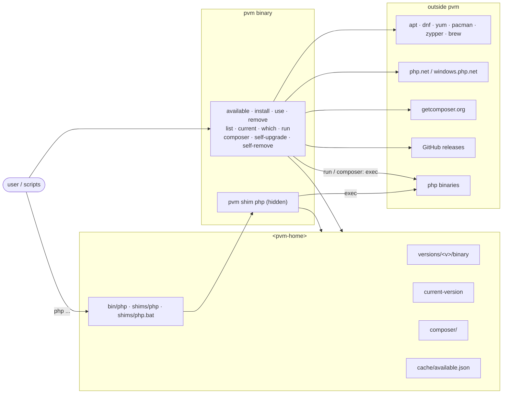
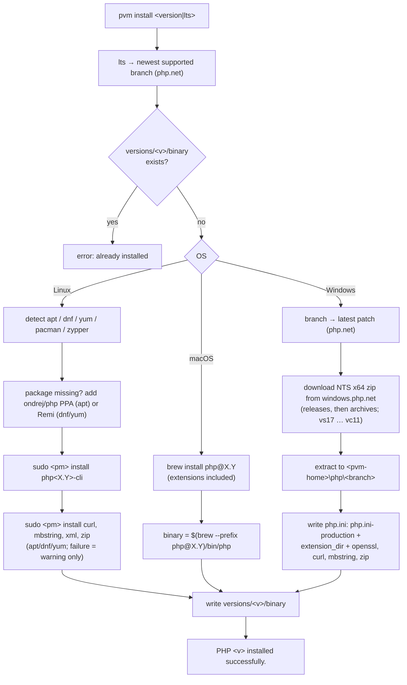
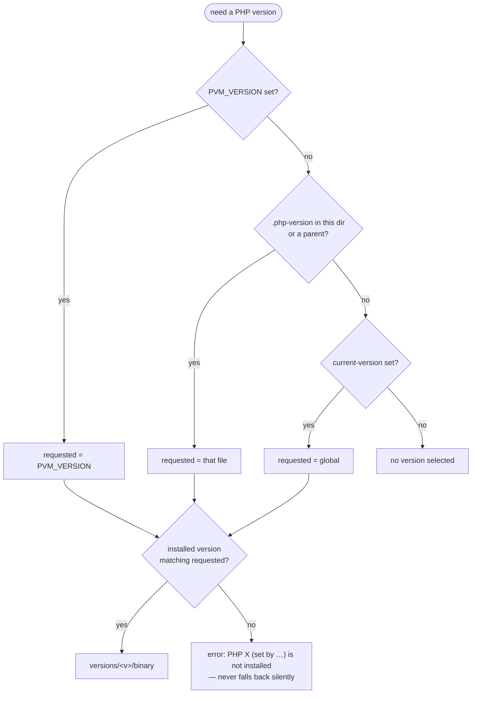
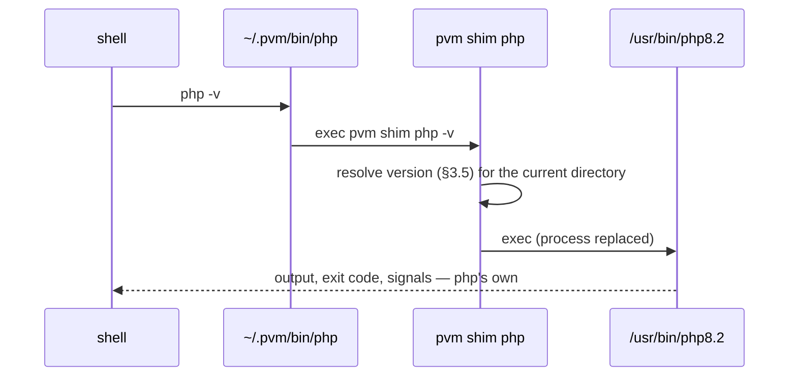
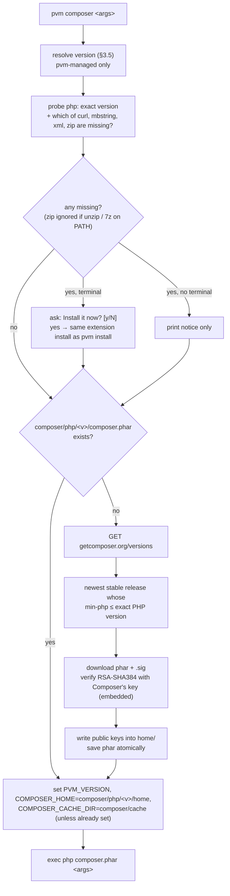

# How pvm works — end-to-end flow

This document follows pvm from first use to uninstall: what each step does, which files it reads and writes, and how the steps connect. For the options of each command see [commands.md](commands.md); for packages and code-level data flow see [architecture.md](architecture.md); for working on pvm itself see [development.md](development.md).

Paths use the Linux/macOS names. `<pvm-home>` is `~/.pvm` on Linux/macOS and `%LOCALAPPDATA%\pvm` on Windows, or `$PVM_HOME` when set.

## Contents

1. [The big picture](#1-the-big-picture)
2. [State: what lives where](#2-state-what-lives-where)
3. [Lifecycle, step by step](#3-lifecycle-step-by-step)
   - [Discover](#31-discover--pvm-available) · [Install](#32-install--pvm-install) · [Activate](#33-activate-globally--pvm-use) · [Per project](#34-per-project--php-version) · [Which PHP runs](#35-which-php-runs) · [`php`](#36-running-php--the-shim) · [`pvm run`](#37-pvm-run) · [`pvm composer`](#38-pvm-composer) · [Remove](#39-remove--pvm-remove) · [Upgrade pvm](#310-upgrade-pvm--pvm-self-upgrade) · [Uninstall](#311-uninstall--pvm-self-remove)
4. [A session, start to finish](#4-a-session-start-to-finish)
5. [Platform differences](#5-platform-differences)
6. [Principles behind the flow](#6-principles-behind-the-flow)

## 1. The big picture

pvm is a single binary. It never keeps a daemon running and never edits shell config files; everything it knows is in a few plain files under `<pvm-home>`, and every command reads those files, acts, and exits.

Three ideas carry the whole design:

- **A version is "installed" when `versions/<v>/binary` exists** and points at an existing php binary. Every command that needs a version reads that file; nothing scans the system.
- **The active version is decided per call**, not per shell: `PVM_VERSION`, then the nearest `.php-version`, then the global `current-version` ([§3.5](#35-which-php-runs)). There is nothing to "activate" in a terminal.
- **Everything pvm brings in lives under `<pvm-home>`** and is removed by pvm: shims, Composer, caches, and on Windows the PHP builds themselves. On Linux/macOS, PHP comes from the system package manager, which pvm drives and also uses to remove it.

## 2. State: what lives where

| Path | Holds | Written by | Read by | Removed by |
|------|-------|------------|---------|------------|
| `versions/<v>/binary` | path of the php binary for `<v>` (e.g. `/usr/bin/php8.3`) | `install` | every command that needs a version | `remove`, `self-remove` |
| `current-version` | the global version, e.g. `8.3` | `use` | `list`, `current`, `which`, `run`, `composer`, the shim | `remove` of the active version (Linux/macOS), `self-remove` |
| `bin/php` (Linux) · `shims/php` (macOS) | `#!/bin/sh` shim: `exec pvm shim php "$@"` | `use` | the shell, via `PATH` | `self-remove` |
| `shims\php.bat` (Windows) | batch shim running `php\<current-version>\php.exe` | `use` | the shell, via `PATH` | `self-remove` |
| `php\<branch>\` (Windows) | the extracted PHP build, with the `php.ini` pvm writes | `install` | the shims, via `binary` | `remove`, `self-remove` |
| `cache/available.json` | php.net branch list, valid 24 h | `available` | `available` | `self-remove` |
| `composer/php/<v>/composer.phar` | the Composer of PHP `<v>` | `composer` (first use), then Composer's `self-update` | `composer` | `remove`, `self-remove` |
| `composer/php/<v>/home/` | `COMPOSER_HOME` of PHP `<v>`: config, `auth.json`, global packages, self-update backups, public keys | `composer` / Composer | Composer | `remove`, `self-remove` |
| `composer/cache/` | `COMPOSER_CACHE_DIR`, shared by all versions | Composer | Composer | `self-remove` |
| `.php-version` (in a project) | the project's version | **the user** — pvm never writes it | the shim, `use` (no args), `current`, `which`, `run`, `composer` | the user |

Outside `<pvm-home>`, pvm touches only what the platform requires:

| Where | What | Set by | Undone by |
|-------|------|--------|-----------|
| Linux system packages | `php<X.Y>-cli` and the curl, mbstring, xml, zip extensions (apt/dnf/yum) | `install` (`sudo`) | `remove`, `self-remove --php` |
| Linux `update-alternatives` | `/usr/bin/php` → the global version, for services that don't use the shim | `use` (`sudo`) | `remove` of the active version (`--auto`) |
| `~/.local/bin/php` (Linux) | updated **only if it already is a symlink** | `use` | — |
| Homebrew | `php@X.Y` | `install` | `remove`, `self-remove --php` |
| Windows user `PATH` | `<pvm-home>\shims` prepended | `use` | `self-remove` |
| PowerShell `$PROFILE` | `# pvm-wrapper` block: refreshes `$env:PATH` after `pvm use` | `use` | `self-remove` |

## 3. Lifecycle, step by step

### 3.1 Discover — `pvm available`

1. Reads `cache/available.json`; if it is younger than 24 h (and `--refresh` was not given), prints it.
2. Otherwise asks php.net for the active major versions, then one request per major in parallel for all patches, keeps the newest patch per branch, and writes the cache.
3. Prints `BRANCH · LATEST · STATUS` (`supported` / `eol`).

Nothing else is read or changed. `pvm install lts` uses the same php.net data to turn `lts` into the newest supported branch.

### 3.2 Install — `pvm install`

- The version is recorded as typed after alias resolution: `pvm install 8.3` records `8.3` (the package manager picks the patch); `8.3.30` records `8.3.30`.
- **Install does not activate anything**: no shim, no `current-version`. Use `pvm use`, a `.php-version`, or `pvm run`.
- The extensions (and on Windows the `php.ini`) exist so that `pvm composer` and the usual frameworks need nothing else on the machine — see [§3.8](#38-pvm-composer).

### 3.3 Activate globally — `pvm use`

1. The version comes from the argument, or — with none — from the nearest `.php-version`.
2. `lts` is resolved; the version must be installed.
3. Per OS:
   - **Linux**: `sudo update-alternatives --set php <binary>` (so `/usr/bin/php` follows too), writes the `bin/php` shim, updates `~/.local/bin/php` if it is a symlink.
   - **macOS**: writes the `shims/php` shim.
   - **Windows**: writes `shims\php.bat`, prepends `shims` to the user `PATH`, adds or refreshes the `# pvm-wrapper` block in `$PROFILE`.
4. Writes `current-version`.
5. If the shim directory is not in `PATH`, prints the line to add (Linux/macOS) or `. $PROFILE` (Windows). This is the only manual step pvm ever asks for.

The shim is regenerated on every `use` because it embeds the absolute path of the pvm binary.

### 3.4 Per project — `.php-version`

A project pins its version by committing a `.php-version` file (`8.3` or `8.3.30`; blank lines and `#` comments are ignored). pvm only reads it, searching from the current directory up to `/`. A branch like `8.3` matches the highest installed `8.3.x`.

`pvm use` without arguments makes that version global; it is not needed for the project itself — inside the project the file already wins over the global version.

### 3.5 Which PHP runs

Every consumer uses the same resolution, `resolveActive` in `cmd/active.go`:

What each consumer does when nothing is selected differs on purpose:

| Consumer | Nothing selected |
|----------|------------------|
| `php` (the shim) | runs the first `php` on `PATH` outside pvm's shim dir (system PHP) |
| `pvm run` | error — pass a version (`pvm run 8.3 …`) or `pvm use` |
| `pvm composer` | error — `pvm use <version>`; never runs Composer on a PHP pvm doesn't manage |
| `pvm current` | prints `No PHP version is currently active.` |
| `pvm which` | error — `pvm use <version>` |

`pvm current` also says where the version came from, e.g. `(set by /home/me/app/.php-version)`.

### 3.6 Running `php` — the shim

- On Linux/macOS pvm `exec`s php, so the pvm process disappears; the cost is about 2 ms per call.
- **Windows:** `php.bat` reads `current-version` directly, so plain `php` always uses the **global** version there. `.php-version` and `PVM_VERSION` are honoured on Windows by `pvm run`, `pvm composer`, `pvm current` and `pvm which`.

### 3.7 `pvm run`

1. Splits the optional version (first argument that looks like a version, or `-v`/`--version`) from the php arguments; everything after `--` goes to the script.
2. Requires a PHP file that exists.
3. Version given → it must be installed; none → [§3.5](#35-which-php-runs).
4. Sets `PVM_VERSION=<v>`, so anything the script starts that calls `php` through the shim — Composer, `#!/usr/bin/env php` tools — uses the same version.
5. `exec`s php (Windows: child process with the same stdio and exit code).

### 3.8 `pvm composer`

Composer is never installed globally and never at `pvm install` time. Each PHP version gets its own Composer the first time `pvm composer` runs with it.

- **Every Composer command works**: all arguments, including `-h`, `-V` and `--`, go to Composer unchanged; stdout and the exit code are Composer's. pvm's own messages (download, missing-extension notice) go to stderr.
- **Release choice** follows `composer self-update`'s rule, from Composer's own list — today 2.10.x for PHP ≥ 7.2.5 and the 2.2 LTS for PHP 5.3–7.2.4. When Composer raises its minimum PHP, pvm follows without a new release.
- **Verification**: a phar whose signature doesn't match Composer's release key is rejected and nothing is saved.
- **Isolation**: the phar and `COMPOSER_HOME` are per PHP version, so `self-update`, `self-update --2.2`, `--rollback` and `global require` for one version cannot break another. Only the download cache is shared, since packages don't depend on PHP. As a consequence, credentials set with `config --global` (`auth.json`) are per version too; a project `auth.json` or `COMPOSER_AUTH` work for all versions.
- **Updating Composer** is `pvm composer self-update`; pvm itself never replaces an existing phar.
- Composer's own requirements still apply: `git` for source installs; extraction and the common extensions are covered by [§3.2](#32-install--pvm-install).

### 3.9 Remove — `pvm remove`

1. The version must be given exactly as installed (see `pvm list`).
2. Uninstalls it: Linux removes the extension packages, then `php<X.Y>-cli`; macOS `brew uninstall php@X.Y`; Windows deletes `php\<branch>\`.
3. Deletes `versions/<v>/` and `composer/php/<v>/`.
4. If it was the active global version: Linux runs `update-alternatives --auto php`; Linux/macOS delete `current-version`; a warning says no version is active. **Windows:** `current-version` is currently left in place (removing the global version there is not implemented yet), so `pvm use <other>` should follow.

Projects whose `.php-version` names the removed version now fail with `PHP X is not installed — run: pvm install X`; pvm never silently switches them to another version.

### 3.10 Upgrade pvm — `pvm self-upgrade`

1. Deletes a leftover `pvm.exe.old` (Windows).
2. Target tag: the one given, or the latest GitHub release. Same as the running version → stops. `--check` only reports.
3. Downloads `pvm-<os>-<arch>.tar.gz` (Windows `.zip`) and extracts the binary.
4. Writes it next to the running binary and renames it into place; on Windows the running `.exe` is first moved to `pvm.exe.old`. A failure never leaves a half-written binary.
5. Not writable → `permission denied` with the `sudo` / Administrator hint.

`<pvm-home>` is untouched: installed versions, shims and Composer keep working. The shim embeds the pvm path, which does not change.

### 3.11 Uninstall — `pvm self-remove`

1. Refuses when `<pvm-home>` is the home or root directory.
2. Lists the binary, `<pvm-home>` and the installed versions; asks for confirmation (`--yes` skips).
3. `--php`: removes every version like `pvm remove` does. Without it, Linux/macOS packages are kept; on Windows the builds live in `<pvm-home>` and go anyway.
4. Windows: removes `shims` and pvm's directory from the user `PATH` and the `# pvm-wrapper` block from `$PROFILE`.
5. Deletes `<pvm-home>` — shims, `current-version`, caches, every Composer.
6. Deletes the binary (Windows: renamed, then deleted by a detached `cmd.exe` after pvm exits).

Left for the user: the `export PATH=…` line they added on Linux/macOS, and `.php-version` files in their projects.

## 4. A session, start to finish

Linux, starting from nothing:

| # | Command | Result | State after |
|---|---------|--------|-------------|
| 1 | `pvm available` | branch table | `cache/available.json` |
| 2 | `pvm install 8.3` | apt installs `php8.3-cli`, `php8.3-{curl,mbstring,xml,zip}` | `versions/8.3/binary` = `/usr/bin/php8.3` |
| 3 | `pvm install 7.4` | PPA added, `php7.4-cli`, `php7.4-{curl,mbstring,xml,zip}` | `versions/7.4/binary` |
| 4 | `pvm use 8.3` | `/usr/bin/php` → 8.3, PATH hint | `bin/php`, `current-version` = `8.3` |
| 5 | add `~/.pvm/bin` to `PATH` once | — | shell config (by the user) |
| 6 | `cd legacy && echo 7.4 > .php-version` | — | project file (by the user) |
| 7 | `php -v` in `legacy/` | PHP 7.4 | — |
| 8 | `php -v` elsewhere | PHP 8.3 | — |
| 9 | `pvm composer install` in `legacy/` | downloads Composer 2.10 for 7.4, installs deps resolved for 7.4 | `composer/php/7.4/`, `composer/cache/` |
| 10 | `PVM_VERSION=8.3 pvm composer -V` | downloads Composer for 8.3 | `composer/php/8.3/` |
| 11 | `pvm run 8.3 script.php` | runs with 8.3, whatever the directory | — |
| 12 | `pvm remove 7.4` | apt removes 7.4 | `versions/7.4/` and `composer/php/7.4/` gone; `legacy/` now errors until 7.4 is reinstalled |
| 13 | `pvm self-remove --php` | everything above undone | only the user's `PATH` line and `.php-version` remain |

## 5. Platform differences

| | Linux | macOS | Windows |
|---|---|---|---|
| PHP comes from | apt / dnf / yum / pacman / zypper (`sudo`) | Homebrew | windows.php.net zip, into `<pvm-home>\php` |
| Extensions for Composer (curl, mbstring, xml, zip) | extra packages (apt/dnf/yum) | built in | `php.ini` written by pvm |
| Shim | `~/.pvm/bin/php` (sh) | `~/.pvm/shims/php` (sh) | `shims\php.bat` |
| `php` honours `.php-version` / `PVM_VERSION` | yes | yes | no — global only |
| System `/usr/bin/php` follows `pvm use` | yes (`update-alternatives`) | no | — |
| `PATH` setup | one manual `export` | one manual `export` | automatic (user `PATH` + `$PROFILE`) |
| `pvm run` / `pvm composer` start php by | `exec` | `exec` | child process |
| `self-remove` without `--php` keeps PHP | yes | yes | no (lives in `<pvm-home>`) |

## 6. Principles behind the flow

- **Nothing global, no hidden state.** Everything pvm creates is under `<pvm-home>` or is a package it installed through the package manager — and pvm removes it. It never edits shell config files on Linux/macOS; the PATH line is the user's.
- **Explicit over clever.** A selected version that isn't installed is an error, never a silent fallback. Only the `php` shim falls back to the system PHP, and only when nothing is selected at all.
- **Per-call resolution.** No "current shell" state: the same command in two directories can use two versions, and `PVM_VERSION` overrides for a single call.
- **Only what's needed on the machine.** Composer's extraction needs are met by the PHP pvm installs; Composer itself is downloaded on first use and verified with its publisher's key.
- **Failures don't leave half states.** Binaries, phars and caches are written to a temp file and renamed into place.
